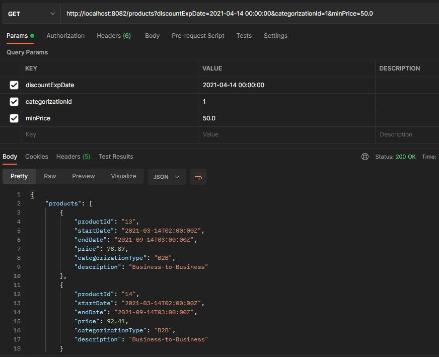

## Summary

The purpose of this project is to create a microservice to manage the categories and products of an e-commerce oriented to sellers who want to expose their product through manomano.

This project is a Java microservice with Spring Boot in which the dependency management is done through Maven. The 
project consists of three layers; controller, service and persistence layer. The project is documented by swagger and 
the contract (*swagger.yml file*) is in OpenApi 3.0.2 version. The controller interface **is generated automatically** 
when compiling the project through a maven plugin. In the service layer there is a **mapper** whose function is to map 
the records obtained from the database **in the response object also defined in the contract**. The persistence layer 
is done using JPA and **spring data jpa** library. The database is an **H2 memory database** for which there is an 
autoloading file *data.sql* in the path ```resources/data.sql```.

Once the microservice starts, you can access the swagger GUI and H2 console using the
following paths:

```
http://localhost:8082/swagger-ui.html#/
http://localhost:8082/h2-console
```

The database credentials are in the file ```application.yml```

##Tasks


1. Create a new entity named **CategorizationType** with the following attributes: id (numeric type), 
   type (text string), desc (text string) and associate it to the existing entity *Product* knowing that *a category 
   can have n products*.
2. Create the following categorization type inserts in the **data.sql** script associated with the entity created in step 1:

   | CATEGORIZATION_ID        | TYPE           | DESCRIPTION  |
       | :-------------: |:-------------:| :-----:|
   | 1      | B2B | Business-to-Business |
   | 2      | B2C      |   Business-to-Consumer |
   | 3 | C2C      |    Consumer-to-Consumer |
   
3. Modify the contract to pass as query param the categorization identifier and the minimum price. Also modify the 
   response object in the contract so that it returns the **categorization type** as well as the **description**.
4. Create an object in the directory ```controller/dto``` that contains the data to be passed
   via the controller's getProducts method.
5. Create the service to obtain all the products filtering by **type of categorization**, 
   **price greater than a given price** and **date given between startDate and endDate** of the product through the 
   Repository **ProductRepository**.
   
6. Create a unit test in the class ```unittest/ProductControllerUnitTest``` to check that if no mandatory parameters are
   passed, return an HTTP 400 BAD REQUEST and execute it.
7. Create the integration test in the ```Integrationtest/ProductControllerIntegrationTest``` class that returns all
    products and run it passing as filters:
   ```
   fecha = 2021-04-14 00:00:00
   categorizationId = 1
   minPrice = 50.00
   ```
8. Compare that the same result is obtained in the following ways:
    - Running the test manually.
    - Using the maven command necessary to pass the tests.
    - Compile, package, start the jar and Perform the necessary query from the H2 console.

# App test results
### Query

GET http://localhost:8082/products?discountExpDate=2021-08-14 02:30:00&categorizationId=2&minPrice=50.0

### Result



## SQL
### Query
```
SELECT products.*,
       categorization_type.type
FROM   products
       LEFT OUTER JOIN categorization_type
                    ON products.categorization_id =
                       categorization_type.categorization_id
WHERE  price > 50
       AND products.categorization_id = '2'
       AND start_date <= '2021-08-14 02:30:00'
       AND end_date >= '2021-08-14 02:30:00'  
```

### Result

